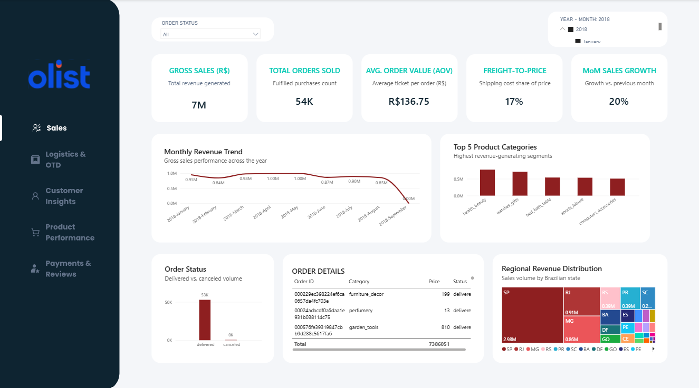
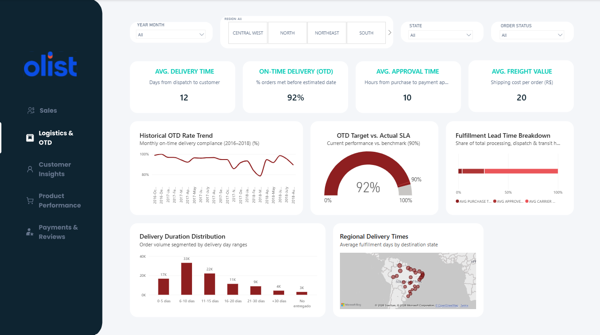
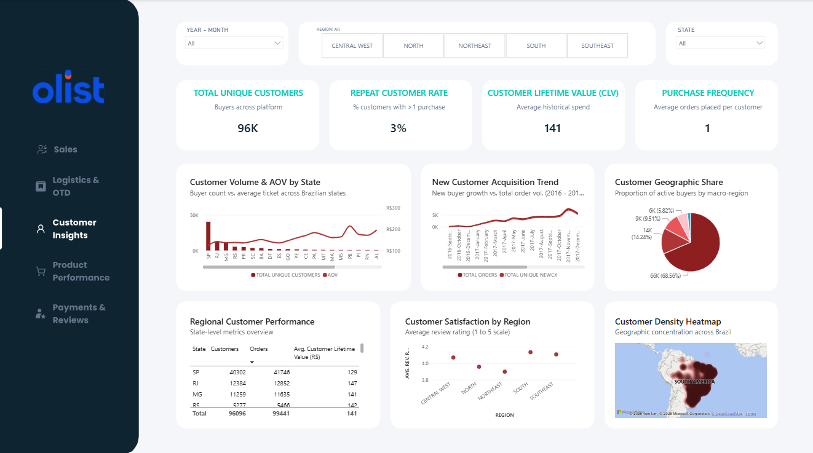
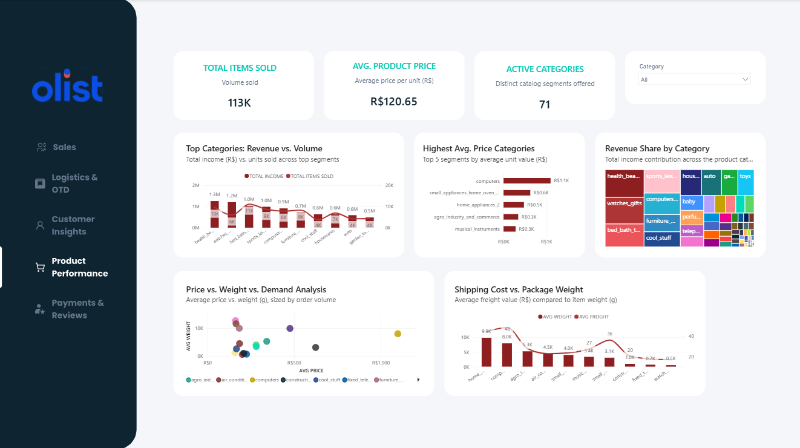
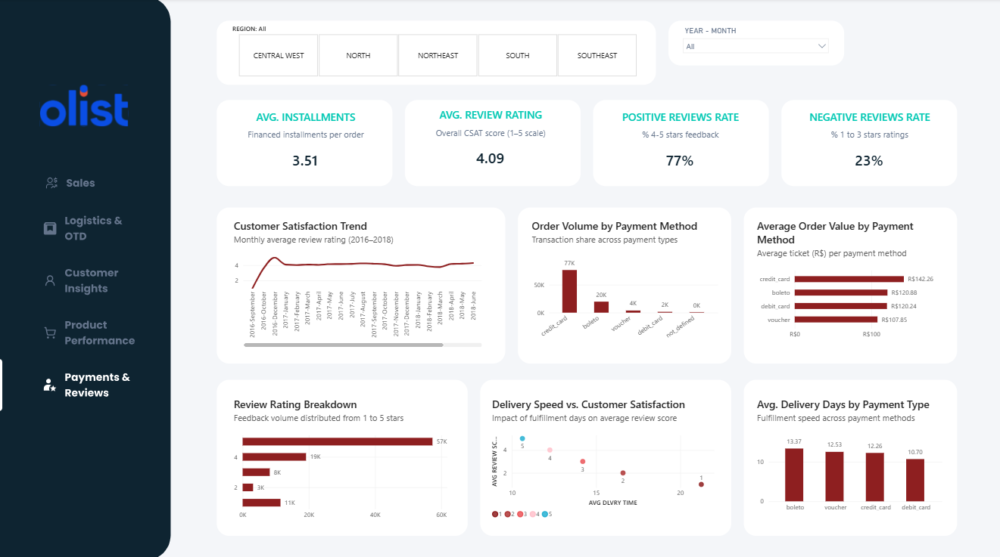
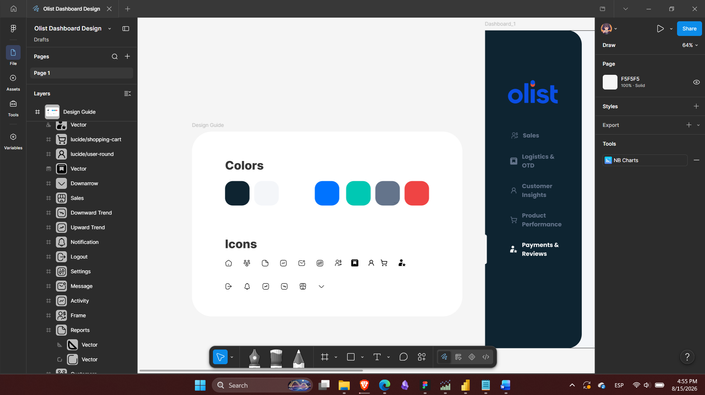

# Olist Brazilian E-Commerce Analytics Dashboard

## 1. Project Overview & Company Background
**Olist** is a major Brazilian e-commerce enabler and marketplace integrator operating across Brazil. It allows small and medium-sized merchants (SMBs) to list and sell their product inventories across Brazil's largest online marketplaces (such as Mercado Livre, B2W, Amazon, and Magazine Luiza) through a single unified platform.

Managing logistics, payment gateways, product variety, and fulfillment times across continental-scale Brazilian territory introduces critical operational challenges. This Power BI analytics project delivers an end-to-end business intelligence solution—designed in **Figma** and modeled in **Power BI**—to track commercial performance, logistic SLAs, customer lifetime value, catalog economics, and customer satisfaction.

---

## 2. Dataset & Data Architecture
The dataset was obtained from the official **Brazilian E-Commerce Public Dataset by Olist on Kaggle**, comprising real commercial records between **2016 and 2018**.

### Relational Schema Tables
* **`olist_orders_dataset`**: Core transaction table tracking order status, order creation, approval timestamp, carrier pickup, and delivery timestamps.
* **`olist_order_items_dataset`**: Line-item details containing item price, freight value, product IDs, and seller IDs.
* **`olist_customers_dataset`**: Customer identifiers, geographic state (`customer_state`), and city.
* **`olist_products_dataset`**: Product dimensions (weight in grams, length, height, width) and category names.
* **`product_category_name_translation`**: English translations for Portuguese category names.
* **`olist_order_payments_dataset`**: Transaction payment types (*credit card, boleto, voucher, debit card*), installments, and payment values.
* **`olist_order_reviews_dataset`**: Customer feedback scores (1 to 5 stars), review survey creation, and response timestamps.
* **`olist_sellers_dataset`**: Merchant registry and location coordinates.
* **`olist_geolocation_dataset`**: Brazilian zip code prefix coordinates (latitude and longitude) used for spatial mapping.

---

## 3. Detailed Page-by-Page Analysis

---

### Page 1: Sales Overview

#### Business Context & Hypotheses
Commercial leadership needs to evaluate overall revenue performance, average order size, freight burdens, and geographic concentration.
* **Hypothesis:** Revenue is heavily centralized in the industrialized Southeast region (São Paulo, Rio de Janeiro, Minas Gerais), while smaller peripheral markets bear higher relative freight costs.



#### Key Visuals & Role
* **KPI Header Cards:** Track aggregate `GROSS SALES`, `TOTAL ORDERS SOLD`, `AVG. ORDER VALUE (AOV)`, `FREIGHT-TO-PRICE`, and `MoM SALES GROWTH`.
* **Monthly Revenue Trend (Line Chart):** Identifies revenue seasonality, peak months, and baseline sales trajectory.
* **Top 5 Product Categories (Bar Chart):** Highlights the strongest revenue-generating sectors (`health_beauty`, `watches_gifts`, `bed_bath_table`).
* **Regional Revenue Distribution (Treemap):** Visualizes sales concentration across Brazilian federative units (UF).
* **Order Status & Granular Details:** Monitors delivered volume versus cancellations and provides transactional auditability.

#### Key Findings & Insights
* **State Dominance:** São Paulo (`SP`) represents the single largest market share (>40% of total gross sales), followed by `RJ` and `MG`.
* **Healthy Basket Size:** Platform Average Order Value (AOV) stabilizes around **R$ 136.75**.
* **Freight Burden:** Freight costs account for ~**17%** of total product prices across sales transactions.

#### Core DAX Measures & Purpose
```
-- Total Gross Revenue generated from item sales
GROSS SALES = SUM(olist_order_items_dataset[price])

-- Average basket size per distinct transaction
AVG. ORDER VALUE (AOV) = 
DIVIDE([GROSS SALES], DISTINCTCOUNT(olist_orders_dataset[order_id]), 0)

-- Ratio of freight costs over total product merchandise value
FREIGHT-TO-PRICE = 
DIVIDE(SUM(olist_order_items_dataset[freight_value]), [GROSS SALES], 0)

-- Month-over-Month growth rate conditioned on month selection
MOM GROWTH % = 
IF(
    HASONEVALUE(calendar_table[Month]),
    VAR INCOME_CURRENT_MONTH = SUM(olist_order_items_dataset[price])
    VAR INCOME_PREV_MONTH = 
        CALCULATE(
            SUM(olist_order_items_dataset[price]),
            PREVIOUSMONTH(calendar_table[Fecha])
        )
    RETURN
        DIVIDE(INCOME_CURRENT_MONTH - INCOME_PREV_MONTH, INCOME_PREV_MONTH),
    BLANK()
)
```

### Page 2: Logistics & On-Time Delivery (OTD)

#### Business Context & Hypotheses
Logistics is the primary driver of customer experience in e-commerce.  
* **Hypothesis:** Meeting the estimated delivery date (On-Time Delivery SLA) directly protects brand trust; transit delays are disproportionately concentrated in the Northern and Northeastern regions due to long-haul carrier routing.



#### Key Visuals & Role
* **OTD SLA Gauge & Historical Trend:** Compares current compliance against the 90% SLA benchmark across time.
* **Delivery Duration Distribution (Histogram/Bar):** Analyzes order volume grouped by delivery completion bins (`0-5 days`, `6-10 days`, `11-15 days`, `+30 days`).
* **Fulfillment Lead Time Breakdown (Stacked Bar):** Decomposes lead time into *Purchase-to-Approval*, *Approval-to-Carrier Dispatch*, and *Carrier-to-Customer Transit*.
* **Regional Delivery Heatmap:** Maps geographic fulfillment latencies across Brazil.

#### Key Findings & Insights
* **High SLA Compliance:** Overall OTD stands at **92%**, successfully surpassing the 90% target.
* **Lead Time Profile:** The median delivery window falls between **6 to 10 days** (33K orders).
* **Bottleneck Identification:** The carrier transit phase represents over 80% of total fulfillment lead time; payment approval takes an average of ~10 hours.

#### Core DAX Measures & Purpose
```dax
-- Percentage of delivered orders arrived on or before estimated date
ON-TIME DELIVERY (OTD) = 
DIVIDE(
    CALCULATE(
        COUNTROWS(olist_orders_dataset), 
        olist_orders_dataset[order_delivered_customer_date] <= olist_orders_dataset[order_estimated_delivery_date]
    ),
    CALCULATE(
        COUNTROWS(olist_orders_dataset), 
        NOT(ISBLANK(olist_orders_dataset[order_delivered_customer_date]))
    ),
    0
)

-- Average calendar days from carrier shipment to customer doorstep
AVG. DELIVERY TIME = 
AVERAGEX(
    olist_orders_dataset,
    DATEDIFF(
        olist_orders_dataset[order_delivered_carrier_date], 
        olist_orders_dataset[order_delivered_customer_date], 
        DAY
    )
)

-- Average approval duration in hours
AVG. APPROVAL TIME (HRS) = 
AVERAGEX(
    olist_orders_dataset,
    DATEDIFF(
        olist_orders_dataset[order_purchase_timestamp], 
        olist_orders_dataset[order_approved_at],
```
        MINUTE
    ) / 60
)

## Page 3: Customer Insights

### Business Context & Hypotheses
Analyzes customer acquisition velocity, geographic reach, retention, and buyer value.



**Hypothesis:** Marketplace acquisition is largely top-of-funnel driven, with low organic repurchase rates requiring loyalty activation strategies.

### Key Visuals & Role
- **KPI Overview:** Tracks TOTAL UNIQUE CUSTOMERS, REPEAT CUSTOMER RATE, CUSTOMER LIFETIME VALUE (CLV), and PURCHASE FREQUENCY.
- **Customer Acquisition Trend (Line Chart):** Compares total order volume against net-new buyer influx.
- **Customer Volume & AOV by State (Combo Chart):** Contrasts customer base size with average spending capacity.
- **Regional Geographic Share & Satisfaction Plots:** Evaluates customer market concentration alongside regional satisfaction ratings.

### Key Findings & Insights
- **Single-Purchase Marketplace Behavior:** The platform exhibits a 3.0% Repeat Customer Rate and 1.03 Purchase Frequency, typical of marketplace environments lacking dedicated retention programs.
- **Regional Value Divergence:** While São Paulo generates the highest customer volume, peripheral states (e.g., Acre, Roraima, Paraíba) present higher AOVs to offset higher shipping costs.
- **Geographic Concentration:** Over 68.5% of active buyers reside in the Southeast macro-region.

### Core DAX Measures & Purpose

```dax
-- Total distinct active buyers across the ecosystem
TOTAL UNIQUE CUSTOMERS = DISTINCTCOUNT(olist_customers_dataset[customer_unique_id])

-- Proportion of users with more than one historical order
REPEAT CUSTOMER RATE = 
VAR MultiBuyers = 
    COUNTROWS(
        FILTER(
            VALUES(olist_customers_dataset[customer_unique_id]),
            CALCULATE(DISTINCTCOUNT(olist_orders_dataset[order_id])) > 1
        )
    )
RETURN
    DIVIDE(MultiBuyers, [TOTAL UNIQUE CUSTOMERS], 0)

-- Customer Lifetime Value (CLV)
CUSTOMER LIFETIME VALUE = 
DIVIDE([GROSS SALES], [TOTAL UNIQUE CUSTOMERS], 0)
```

---

## Page 4: Product Performance

### Business Context & Hypotheses
Investigates product catalog distribution, pricing tiers, item weights, and associated freight sensitivities.



**Hypothesis:** Bulky and heavy items experience lower purchase frequency due to high freight costs, while high-value electronics maintain distinct margin dynamics.

### Key Visuals & Role
- **Top Categories Revenue vs. Volume (Combo Chart):** Identifies high-volume vs. high-margin catalog segments.
- **Highest Avg. Price Categories (Bar Chart):** Ranks premium categories (computers, small_appliances, agro_industry).
- **Price vs. Weight vs. Demand (Scatter Plot):** Correlates average price against product weight, bubble-sized by order volume.
- **Shipping Cost vs. Package Weight (Dual Axis Chart):** Shows the direct correlation between physical product weight (g) and freight charges.

### Key Findings & Insights
- **Volume Drivers vs. Value Drivers:** health_beauty and bed_bath_table drive pure transaction volume, whereas computers commands the highest average unit price (>R$ 1,100).
- **Logistics-Weight Penalty:** Freight costs scale exponentially above 5,000 grams, directly impacting buyer drop-off in heavy furniture categories.

### Core DAX Measures & Purpose

```dax
-- Total physical items dispatched
TOTAL ITEMS SOLD = COUNTROWS(olist_order_items_dataset)

-- Average product list price per item
AVG. PRODUCT PRICE = AVERAGE(olist_order_items_dataset[price])

-- Active product categories offering orders
ACTIVE CATEGORIES = DISTINCTCOUNT(olist_products_dataset[product_category_name])
```

---

## Page 5: Payments & Customer Satisfaction (CSAT)

### Business Context & Hypotheses
Examines the relationship between payment gateway settlement times, installment financing, and customer review scores.



**Hypothesis:** Boleto Bancário orders exhibit longer end-to-end delivery times due to banking settlement delays (1–3 business days), which negatively impacts review ratings compared to instant payment methods.

### Key Visuals & Role
- **Satisfaction KPIs:** Evaluates AVG. REVIEW RATING, POSITIVE REVIEWS RATE (4–5 stars), NEGATIVE REVIEWS RATE (1–3 stars), and AVG. INSTALLMENTS.
- **Review Score Distribution (Bar Chart):** Tracks customer review breakdown (57K 5-star ratings vs. 11K 1-star ratings).
- **Delivery Speed vs. Customer Satisfaction (Scatter Plot):** Demonstrates how fulfillment days correlate with review ratings.
- **Avg. Delivery Days by Payment Type (Bar Chart):** Contrasts fulfillment durations across Boleto, Voucher, Credit Card, and Debit Card.

### Key Findings & Insights
- **Strong Overall Satisfaction:** 77% of all submitted reviews are positive (4–5 stars), driving an overall rating of 4.09 / 5.0.
- **Delivery Speed is King:** 5-star orders average 10.2 delivery days, whereas 1-star ratings average over 20.5 delivery days.
- **The Boleto Effect:** Boleto orders take the longest total lead time (13.37 days) due to the 24–72h banking clearance delay before seller fulfillment begins, compared to 10.70 days for instant debit card orders.
- **Installment Culture:** Credit cards dominate transaction share (77K orders), averaging 3.51 installments per purchase.

### Core DAX Measures & Purpose

```dax
-- Average customer review score (1-5 scale)
AVG. REVIEW RATING = AVERAGE(olist_order_reviews_dataset[review_score])

-- Positive review rate (% of 4 and 5 stars)
POSITIVE REVIEWS RATE = 
DIVIDE(
    CALCULATE(
        COUNTROWS(olist_order_reviews_dataset), 
        olist_order_reviews_dataset[review_score] >= 4
    ),
    COUNTROWS(olist_order_reviews_dataset),
    0
)

-- Negative review rate (% of 1, 2, and 3 stars)
NEGATIVE REVIEWS RATE = 
DIVIDE(
    CALCULATE(
        COUNTROWS(olist_order_reviews_dataset), 
        olist_order_reviews_dataset[review_score] <= 3
    ),
    COUNTROWS(olist_order_reviews_dataset),
    0
)

-- Average installment count on financed transactions
AVG. INSTALLMENTS = AVERAGE(olist_order_payments_dataset[payment_installments])
```

---

## 4. UI/UX Design System (Figma)



**Design:** Ddashboard design built using Figma with a 1080x1050 (Full HD) resolution 😊

### Color Palette

| Element | Colors |
|---|---|
| **Background & Cards** | white background (`#F5F5F5`) |
| **Primary colors** | Olist Navy (`#0A192F`), Olist Turquoise (`#00C8B3`) and Burgundy (`#801B1B`)|


